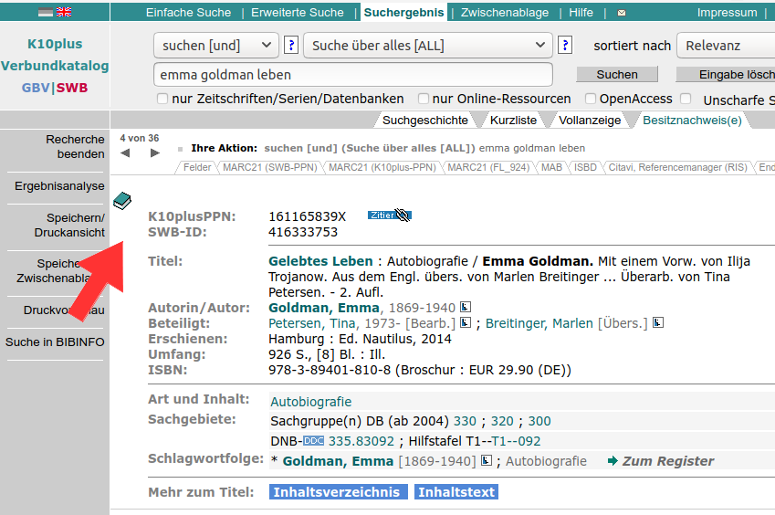

# Schnittstellen

Für den lesenden Zugriff auf PICA-Daten gibt es [unAPI](#unapi) für einzelne Datensätze und [SRU](#sru) zur Abfrage von Suchergebnissen. Darüber hinaus können PICA-Daten manuell über die [OPAC-Oberfläche](#opac) und mit [WinIBW](#winibw) heruntergeladen werden.

## unAPI

Die unAPI-Schnittstelle ermöglicht den Abruf einzelner PICA-Datensätze mittels ihrer PPN. Zusätzlich muss ein Datenbankkürzel angegeben werden und in welchem Format der Datensatz zurückgeliefert werden soll.

?> [unAPI im K10plus-Wiki](https://wiki.k10plus.de/display/K10PLUS/UnAPI)

?> [unAPI im GBV-Verbundwiki](https://verbundwiki.gbv.de/display/VZG/unAPI)

### Beispiel

Der Datensatz mit der [PPN 161165839X](https://opac.k10plus.de/DB=2.299/PPNSET?PPN=161165839X) aus dem K10plus-Verbundkatalog (`opac-de-627`) lässt sich im PICA Plain Format (`pp`) unter der URL <http://unapi.k10plus.de/?id=opac-de-627:ppn:161165839X&format=pp> abrufen. Auf der Unix-Kommandozeile ist dies beispielsweise mit `curl` möglich so dass und anschließend mit [`picadata`](verarbeitung?id=picadata) weiterverarbeitet werden:

~~~bash
curl 'http://unapi.k10plus.de/?id=opac-de-627:ppn:161165839X&format=pp' | picadata '028A|028C'
~~~

~~~pica
028A $9079339735$VTpv1$7gnd/118540475$3161149200$wpiz$AGoldman$DEmma$E1869$M1940
028C $9549565094$VTpv3$7gnd/133610519$3299969355$wpiz$APetersen$DTina$E1973$BBearb.
028C $9634784293$VTpv4$7gnd/142220213$3329568302$wpiz$ABreitinger$DMarlen$BÜbers.
~~~

Für wiederkehrende Abrufe mit unterschiedlicher PPN lohnt es sich ein Shell-Skript anzulegen, das dann beispielsweise als `./kxp 161165839X` aufgerufen werden kann:

~~~bash
cat <<EOF > kxp
#!/bin/bash
curl "http://unapi.k10plus.de/?format=pp&id=opac-de-627:ppn:\$1"
EOF
chmod +x kxp
~~~

## SRU

Die SRU-Schnittstelle dient der Abfrage von Datensätzen aus PICA-Katalogen mittels Suchanfragen.

!> Hier fehlt noch ein ausführliches Beispiel!

?> [SRU im K10plus-Wiki](https://wiki.k10plus.de/display/K10PLUS/SRU)

?> [SRU im GBV-Verbundwiki](https://verbundwiki.gbv.de/display/VZG/SRU)

?> [SRU bei der DNB](http://www.dnb.de/sru)

?> [SRU bei der Zeitschriftendatenbank](https://www.zeitschriftendatenbank.de/services/schnittstellen/sru/)

?> [Wikipedia-Artikel zu SRU](https://de.wikipedia.org/wiki/Search/Retrieve_via_URL)

Zum Testen einer SRU-Anfrage an die K10plus-Datenbank kann mit [Catmandu](verarbeitung?id=catmandu) (und der im entsprechenden Kapitel angegebenen [Konfiguration](catmandu.yaml)) ein einzelner Datensatz per PPN abgerufen werden:

~~~bash
catmandu convert kxp --query "pica.ppn=161165839X" to pp
~~~

## OPAC

In der Standard-Katalogansicht eines PICA-Katalogs (OPAC) lässt sich der PICA-Datensatz eines ausgewählten Titels über einen versteckten Link direkt unter dem Icon der Publikationsform aufrufen (siehe Screenshot). Alternativ kann die lässt Feldansicht auch durch den URL-Bestandteil `/PSR=PP` (nur Titelebene) bzw. `/PRS=PP%7F` (alle Ebenen) aktiviert werden. Der Datensatz in PICA Plain Serialisierung kann anschließend per Copy & Paste in eine Datei kopiert werden.

*Versteckter Link zum PICA-Datensatz (roter Pfeil)*

Unter dem PICA-Datensatz wird in der Feldansicht auch die **Indexierung** des Datensatz angezeigt.

## WinIBW

WinIBW ist zwar nicht frei verfügbar aber das in Bibliotheken am weitesten verbreitete Programm zur Verarbeitung von PICA-Daten. Nicht zuletzt werden PICA-Daten bei der Katalogisierung in der Regel mittels WinIBW in PICA-Datenbanken eingetragen.

?> [Download von Datensätzen in WinIBW](https://wiki.k10plus.de/pages/viewpage.action?pageId=64225417)
